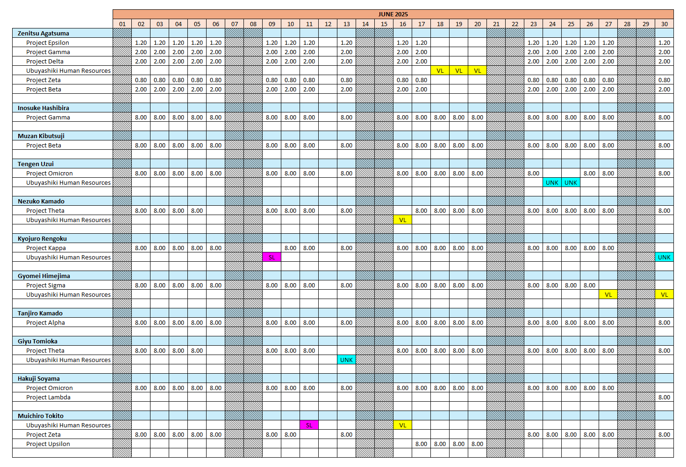

# Excel Timesheet → Calendar Report Generator  
_A modern, automated PowerShell solution for transforming timesheet data into a calendar-style Excel report_

This project converts raw employee timesheet data into a fully formatted **calendar report**.  
It leverages PowerShell and Excel COM automation for fast, in-memory data processing and clean, professional output.

<a href="./images/calendar-output.png" target="_blank"></a>

---

## ⚡ Features

#### **Automated Excel Processing**
- Reads an input Excel timesheet and creates a normalized **Data Sheet**  
- Generates a **Calendar Sheet** with employee/project rows by day  
- Automatically calculates the month and days from the latest date in the dataset  

#### **Smart Data Handling**
- Uses a 2D array for fast in-memory operations  
  - 2D array values are directly inserted to a Range (table), instead of per row or cell insertions 
- Supports leave types (can be easily extended):
  - **VL** → Vacation Leave  
  - **SL** → Sick Leave  
  - **UNK** → Unknown/other leave  

#### **Professional Formatting**
- Weekends shaded automatically  
- Conditional formatting applied for leave types  
- Both Calendar and Data sheets are protected

#### **PowerShell Best Practices**
- Modular functions with clear responsibilities: `Get-EmployeeData`, `Populate-Calendar`, `Set-LeaveFormatting`, `Shade-Weekends`  
- Efficient in-memory string and array handling  
- Clean separation of **data processing**, **calendar construction**, and **formatting**  
- COM objects properly released to avoid memory leaks  

---

## ▶️ Usage & Testing

1. Download the zipped `.xls` test data <a href="https://bit.ly/asoloa-wc-timesheet-data" target="_blank">here</a>.
2. Launch PowerShell (ExecutionPolicy must allow scripts)  
3. Run:
```powershell
.\WorkCalendar.ps1
# OR
powershell -ExecutionPolicy Bypass .\WorkCalendar.ps1
```
4. Select the Excel timesheet file when prompted
5. Output is saved to: `<script-directory>/extracted/yyyyMMdd-HHmmss.xlsx`

---

## 💻 Development Iteration

This script is adapted from one of my personal VBA macro tools.  
Having the process flow and algorithm already defined in the Excel tool made developing the PowerShell version easier.  
However, some improvements were made in the PowerShell version.  
  - The improved PowerShell version utilizes Dictionary chains (`employeeCollection[emp][project][dayIndex] = "hours" / "VL" / "SL"`),  
  and values are inserted only once from a 2D array to a table Range.
  - The Excel version uses regular expressions to detect specific employee's entries, insertions are per row, and redundant/costly processes are present in loop(s).
  
Below is the core code of the Excel version.
```vba
ReDim workHours(0 To calendarDays)
    
Set employeeProj = CreateObject("Scripting.Dictionary")
Set report_ws = ThisWorkbook.Sheets(wsName)
Set data_ws = ThisWorkbook.Sheets(Replace(wsName, "report", "data"))
Set cellIterator = report_ws.Range("B4")

' Transposed to convert the 2D array result from unique to a 1D array
employeeNames = Application.WorksheetFunction.Transpose(Application.WorksheetFunction.Unique(data_ws.Range("A1:A" & lastRow)))

' dataString - string containing all employees' entries taken from the input worksheet,
' with each row converted to a single line, and each values delimited by `vbTab`
' eg. "<employeeName>  <employeeId>  <entryDate>  <projectName>  <projectDesc>  <hours>  <entryType>" ← a single line/row entry
For i = 1 To UBound(employeeNames)
    regEx.Pattern = "^" & employeeNames(i) & vbTab & ".+" & vbTab & ".+" & vbTab & "(.+)" & vbTab & ".+" & vbTab & ".+" & vbTab & ".+"
    If regEx.Test(dataString) Then
        Set objMatches = regEx.Execute(dataString)
        For Each Match In objMatches
            If Not employeeProj.Exists(Match.SubMatches(0)) Then
                employeeProj.Add Match.SubMatches(0), Nothing
            End If
        Next Match
    End If
    
    ' #CAEDFB
    With cellIterator
        .Value = StrConv(employeeNames(i), vbProperCase)
        .IndentLevel = 1
        .Font.Bold = True
        .Resize(1, calendarDays + 1).Interior.Color = "&HFBEDCA"
    End With
    
    Set cellIterator = cellIterator.Offset(1, 0)
    For Each k In employeeProj.Keys()
        cellIterator.Value = k
        cellIterator.IndentLevel = 3
        
        ' IMPROVEMENT: Create a clone and blank workHours. Use that to re-assign blank values to workHours, instead of using loops for every `k`.
        For j = 0 To UBound(workHours)
            workHours(j) = ""
        Next j
        
        regEx.Pattern = "^" & employeeNames(i) & vbTab & ".+" & vbTab & "(.+)" & vbTab & k & vbTab & ".+" & vbTab & "(.+)" & vbTab & "(.+)"
        If regEx.Test(dataString) Then
            Set objMatches = regEx.Execute(dataString)
            For Each Match In objMatches
                ' Match.SubMatches(0) = date
                ' Match.SubMatches(1) = hours
                ' Match.SubMatches(2) = "Reg. Training" | "Vacation Leave" | "Sick Leave"
                If (InStr(Match.SubMatches(2), "Leave") = 0) Then
                    ' Extract the day from date and use as array index
                    workHours(Int(Split(Match.SubMatches(0), "/")(1)) - 1) = CStr(Format(Match.SubMatches(1), "0.00")) & ""
                Else
                    Dim val As String
                    If (InStr(Match.SubMatches(2), "Vacation Leave") > 0) Then
                        val = "VL"
                    ElseIf (InStr(Match.SubMatches(2), "Sick Leave") > 0) Then
                        val = "SL"
                    Else
                        val = "UNK"
                    End If
                    ' Extract the day from date and use as array index
                    workHours(Int(Split(Match.SubMatches(0), "/")(1)) - 1) = val
                End If
            Next Match
        End If
        With cellIterator.Offset(0, 1).Resize(1, calendarDays)
            .Value = workHours
            .HorizontalAlignment = xlCenter
            .VerticalAlignment = xlCenter
        End With
        
        Set cellIterator = cellIterator.Offset(1, 0)
    Next k
    Set cellIterator = cellIterator.Offset(1, 0)
    employeeProj.RemoveAll
Next i
```

---

_This tool was developed and tested in PowerShell 5.1._